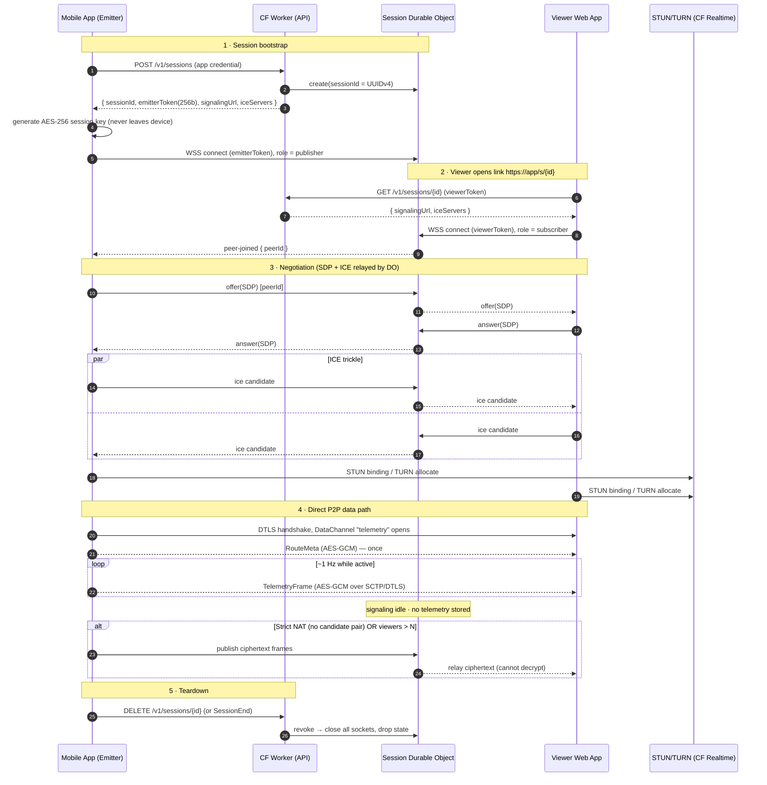
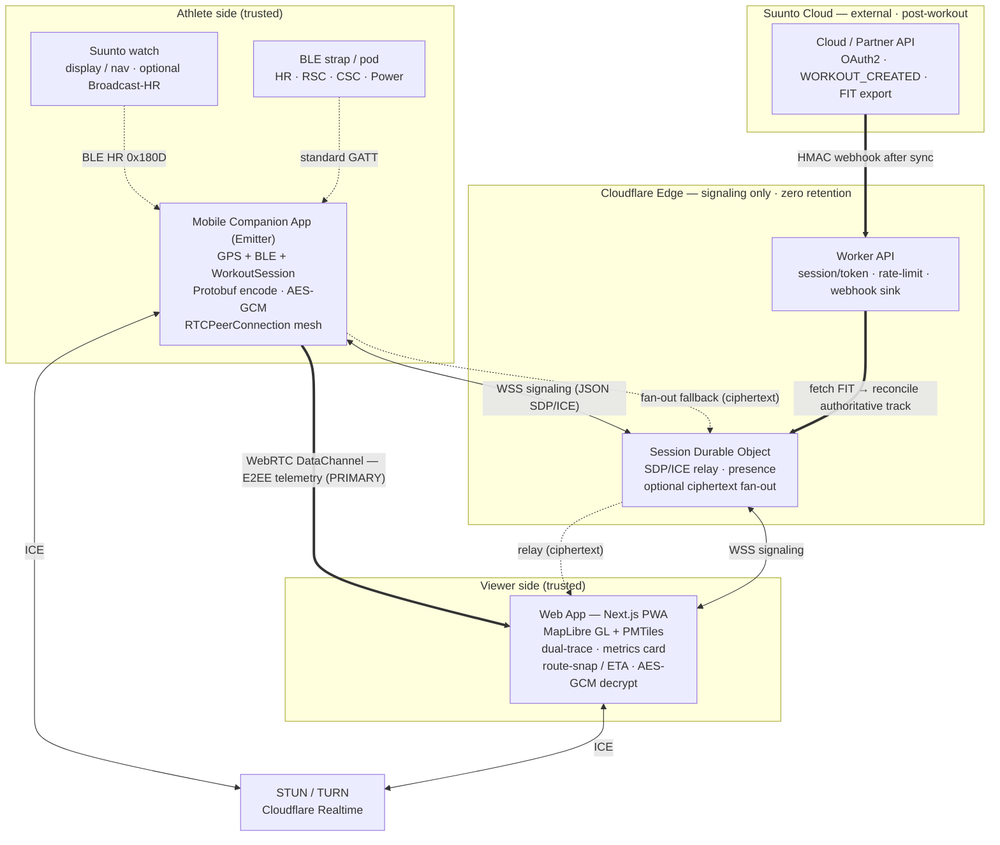
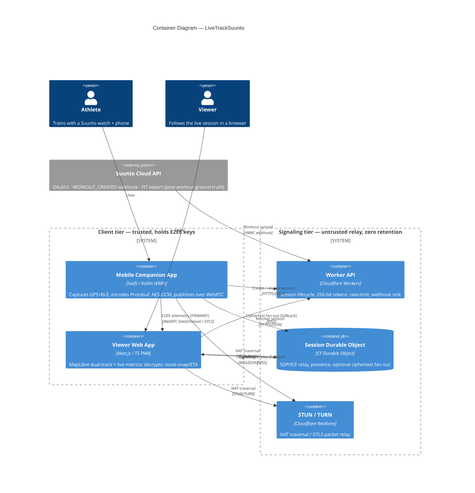
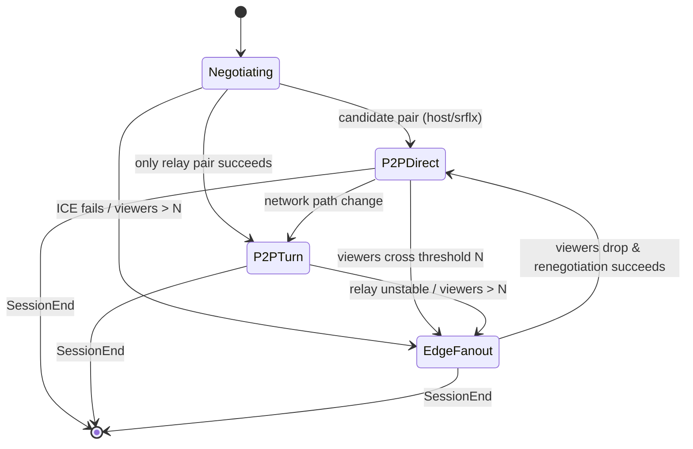

# Phase 3.2 — Architecture & Diagrams

## 1. WebRTC signaling → direct P2P (sequence)

The Durable Object is an **ephemeral SDP/ICE broker only**. Once the DataChannel opens,
telemetry flows peer-to-peer and the DO goes idle (zero telemetry retention). The E2EE
key is generated on the emitter and shared to viewers only via the link fragment
(`#key`), which browsers never send to the server.

## 2. High-level component architecture

## 3. C4 container diagram

## 4. Transport selection state machine

**Threshold policy.** Emitter mesh is cheap for a handful of viewers; beyond
`N` (default **8**, configurable) the per-viewer `RTCPeerConnection` upload cost on a
phone becomes the bottleneck, so we switch that session to **edge fan-out**: the emitter
sends **one** ciphertext stream to the DO, which fans it to all subscribers. E2EE is
preserved because the DO only ever relays AES-GCM ciphertext it cannot decrypt.

## 5. Data-plane vs control-plane summary

| Plane | Path | Payload | Who can read it |
|---|---|---|---|
| Control (signaling) | Client ↔ DO (WSS) | JSON SDP/ICE, presence | Edge sees SDP/ICE only |
| Data — direct | Emitter ↔ Viewer (DTLS/SCTP) | AES-GCM(Protobuf) | Endpoints only |
| Data — TURN | Emitter ↔ TURN ↔ Viewer | DTLS + AES-GCM | Endpoints only (TURN relays opaque UDP) |
| Data — fan-out | Emitter → DO → Viewers (WSS) | AES-GCM(Protobuf) | Endpoints only (DO relays ciphertext) |
| Post-workout | Suunto → Worker → DO | HMAC webhook + FIT | Edge (transient, for reconciliation) |
