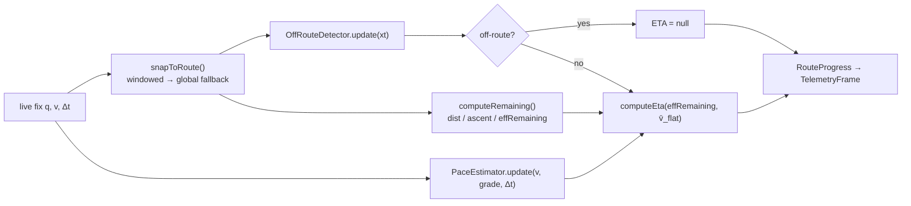

# Phase 3.3 — GPX Route-Snap & Dynamic Grade-Adjusted ETA

Reference implementation: [`packages/geo/src/routeSnap.ts`](../../packages/geo/src/routeSnap.ts).
Runs identically in the browser viewer and in a Durable Object (both V8 isolates), so the
same numbers appear whether the fix arrives P2P or via fan-out.

Notation: planned route is a polyline `P = [p₀ … pₙ]`, `pᵢ = (φᵢ, λᵢ, hᵢ)` (lat, lon,
elevation). A live fix is `q = (φ_q, λ_q)`.

---

## 1. Distances

Segment lengths and route distance use the **haversine** great-circle distance (accuracy
matters over a long route):

```
a  = sin²(Δφ/2) + cos φ₁ · cos φ₂ · sin²(Δλ/2)
d  = 2R · asin(√a),      R = 6 371 008.8 m
```

For the local point-to-segment projection (tens of meters) we use an **equirectangular**
projection about the segment start `pᵢ`, which is essentially exact at that scale and far
cheaper than repeated haversine:

```
x = (λ − λᵢ)·(π/180)·cos φᵢ · R
y = (φ − φᵢ)·(π/180) · R
```

## 2. Preprocessing (once per route)

For `i = 0 … n−1`:

```
segLen[i]   = haversine(pᵢ, pᵢ₊₁)
cumDist[i+1]= cumDist[i] + segLen[i]
grade[i]    = clamp( (hᵢ₊₁ − hᵢ) / segLen[i], −0.45, +0.45 )      // rise/run
```

Cumulative ascent/descent use an **elevation hysteresis** `Δh_hyst` (default 1 m) so
barometer/GPS noise is not accumulated as gain:

```
if (h − eleRef) >  Δh_hyst :  cumAscent += (h − eleRef);  eleRef = h
if (eleRef − h) >  Δh_hyst :  cumDescent += (eleRef − h); eleRef = h
```

`totalDist = cumDist[n]`, `totalAscent = cumAscent[n]`, `totalDescent = cumDescent[n]`.

## 3. Snapping a live fix

For each candidate segment `i`, project `q` onto `[pᵢ, pᵢ₊₁]` in local meters:

```
t   = clamp( ((q−pᵢ)·(pᵢ₊₁−pᵢ)) / |pᵢ₊₁−pᵢ|² , 0, 1 )     // foot parameter
F   = pᵢ + t·(pᵢ₊₁−pᵢ)                                     // foot point
xt  = |q − F|                                              // cross-track distance
```

Pick the segment minimizing `xt`. **Monotonic windowed search** — to survive
out-and-back and self-crossing routes, search only `[lastSeg−back, lastSeg+fwd]`
(defaults 3 / 40 segments) first; fall back to a **global** scan only when the best
windowed `xt > 60 m` (GPS gap / restart). Then:

```
distDone       = cumDist[segIndex] + t · segLen[segIndex]
fraction       = distDone / totalDist                      // 0..1
distRemaining  = totalDist − distDone
```

Remaining climb interpolates cumulative ascent/descent at the foot point:

```
cumAscFoot     = cumAscent[i] + t·(cumAscent[i+1] − cumAscent[i])
ascentRemaining  = totalAscent  − cumAscFoot
descentRemaining = totalDescent − cumDescFoot
```

## 4. Off-route detection (debounced)

Trip **off-route** after `k` consecutive fixes with `xt > θ` (defaults `θ = 30 m`,
`k = 3`); clear immediately on a single in-corridor fix. While off-route, **ETA is
suppressed** (mirrors the watch's own behavior and avoids garbage predictions).

## 5. Dynamic grade-adjusted ETA

Naïve `ETA = distRemaining / v` is wrong on hilly routes: an athlete climbing at 2 m/s
is exerting far more than 2 m/s of flat effort. We normalize with the **Minetti (2002)**
energy cost of running versus gradient `i` (J·kg⁻¹·m⁻¹):

```
C(i) = 155.4 i⁵ − 30.4 i⁴ − 43.3 i³ + 46.3 i² + 19.5 i + 3.6
GAP(i) = C(i) / C(0),   C(0) = 3.6
```

`GAP(i)` > 1 uphill (costs more than flat), < 1 on gentle descents. Two uses:

**(a) Effort-normalized pace.** Each fix updates a flat-equivalent speed via EWMA
(time constant `τ`, default 30 s), ignoring stops (`v < 0.5 m/s`):

```
v_flat_sample = v_instant · GAP(grade_at_snap)
v̄_flat       ← v̄_flat + α·(v_flat_sample − v̄_flat),   α = 1 − e^(−Δt/τ)
```

**(b) Effort-weighted remaining distance.** Convert the remaining route into
flat-equivalent meters:

```
effRemaining = (1−t)·segLen[i]·GAP(grade[i]) + Σ_{j>i} segLen[j]·GAP(grade[j])
```

**ETA:**

```
etaRemainingSec = effRemaining / v̄_flat          (null until v̄_flat primed / off-route)
etaEpochMs      = now + etaRemainingSec·1000
```

This yields an ETA that (i) speeds up on descents and slows on climbs *ahead*, and
(ii) reflects the athlete's *effort* trend rather than instantaneous ground speed. `τ`
trades responsiveness (small) vs stability (large); 30 s is a good default for running.

### Worked micro-example
Remaining: 1.0 km flat + 0.5 km at +10 % grade. `GAP(0)=1`, `GAP(0.10)≈1.658`
→ `effRemaining = 1000·1.0 + 500·1.658 ≈ 1829 m`. If `v̄_flat = 3.33 m/s` (≈5:00/km flat),
`ETA ≈ 1829/3.33 ≈ 549 s ≈ 9m09s` — vs a naïve `1500/3.33 = 450 s (7m30s)` that ignores
the climb. (Verified against `gapFactor()`; a downhill checks out too: `GAP(−0.10)≈0.598`.)

## 6. Pipeline per fix (edge or client)



## 7. Numerical & robustness notes
- **int32 safety**: lat/lon×1e7 max 1.8e9 < 2¹³¹ range; no overflow.
- **Cost bound**: windowed snap is O(fwd+back) ≈ O(43) per fix; a global rescan is O(n)
  but rare (only after a gap). A 10 k-point route re-acquires in < 1 ms.
- **GPS jitter**: optionally pre-filter fixes with a 1-D Kalman / EWMA on position and
  reject fixes with `hAcc > 25 m`; `distDone` is clamped monotonic per session to stop
  the progress bar from ticking backward on noise.
- **Grade clamp** `±0.45` keeps Minetti inside its validated domain (extreme cliffs are
  treated as 45 %).
- **Before start / after finish**: `fraction` clamps to `[0,1]`; once `distRemaining≈0`
  the emitter sends `SessionEnd{COMPLETED}`.
