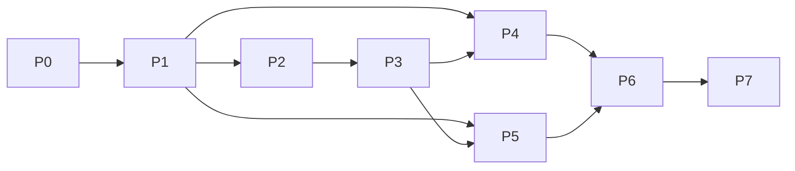

# Phase 3.4 — Project Structure & Execution Roadmap

## 1. Monorepo layout

Tooling: **pnpm workspaces** + **Turborepo** for the TypeScript surfaces (web, signaling,
shared packages); the mobile app is **Kotlin Multiplatform (KMP)** so capture/relay logic
is shared and only the UI is platform-native (SwiftUI / Jetpack Compose).

```
livetracksuunto/
├─ apps/
│  ├─ web/                      # Next.js 15 viewer PWA
│  │  ├─ app/                   #   App Router; /s/[sessionId] live page
│  │  ├─ components/            #   MapView, DualTrace, MetricsCard, EtaBadge
│  │  ├─ lib/                   #   webrtc client, decrypt, map styles
│  │  └─ public/tiles/          #   PMTiles (or remote URL)
│  ├─ signaling/                # Cloudflare Workers + Durable Objects
│  │  ├─ src/worker.ts          #   REST API: sessions, tokens, webhook sink
│  │  ├─ src/session-do.ts      #   SessionDurableObject (SDP/ICE relay, fan-out)
│  │  ├─ src/ratelimit.ts       #   token bucket per IP / per session
│  │  └─ wrangler.toml
│  └─ mobile/                   # KMP
│     ├─ shared/                #   capture, encode, crypto, webrtc, geo (commonMain)
│     ├─ androidApp/            #   Compose UI + Health Services / BLE
│     └─ iosApp/                #   SwiftUI + HealthKit / CoreLocation / CoreBluetooth
├─ packages/
│  ├─ protocol/                 # telemetry.proto + generated bindings + codec + types.ts
│  │  ├─ telemetry.proto
│  │  ├─ src/types.ts           #   domain model (source of truth for UI)
│  │  ├─ src/codec.ts           #   wire <-> domain + AES-GCM frame (de)serialize
│  │  └─ src/gen/               #   ts-proto output (git-ignored, built)
│  ├─ geo/                      # routeSnap.ts (snap + ETA), gpx parser, unit tests
│  ├─ webrtc-core/              # shared signaling FSM + PeerConnection orchestration (TS)
│  └─ config/                   # eslint, tsconfig, prettier presets
├─ suuntoplus-app/              # on-watch SuuntoPlus Sports App (display/controls only)
│  ├─ manifest.json
│  ├─ main.js                   #   onLoad()/evaluate(); shows "LIVE" + session code
│  └─ ui/
├─ infra/
│  ├─ terraform/                #   CF Workers/DO, Realtime TURN, DNS, secrets
│  └─ turn/                     #   Cloudflare Realtime credentials config
├─ e2e/                         # Playwright (viewer) + device-farm harness
├─ turbo.json
├─ pnpm-workspace.yaml
└─ docs/
```

**Dependency direction:** `packages/*` are leaf libraries; `apps/*` depend on them, never
the reverse. `protocol` and `geo` are the only packages shared across web + edge + mobile
(via KMP interop / a thin Kotlin port of `geo`), guaranteeing identical math everywhere.

## 2. Why this shape
- **`protocol` and `geo` are single-sourced** — the Phase 1/2 correctness guarantees
  (consistent schema, identical ETA on client & edge) depend on there being exactly one
  definition of each.
- **`signaling` is deliberately thin** — it must remain a stateless-ish relay to honor the
  zero-retention promise; keeping it isolated stops feature-creep into a data store.
- **`suuntoplus-app` is quarantined** — it is display/controls only (Phase 1 finding: no
  networking in the sandbox); it never becomes a data uplink.

---

## 3. Execution roadmap (infrastructure → deploy)

Each phase has an **exit criterion** (measurable) and its **tests**. Phases P1–P3 unblock
everything; P4/P5 can proceed in parallel once P1 lands.

### P0 — Foundations
- Monorepo bootstrap (pnpm + Turbo), CI (lint/typecheck/test/build), Wrangler + Terraform skeleton, secret management.
- **Exit:** `pnpm turbo build` green in CI; `wrangler deploy --dry-run` passes.

### P1 — Protocol package
- Finalize `telemetry.proto`; wire `ts-proto`, `swift-protobuf`, `wire` codegen; implement `codec.ts` (wire↔domain + AES-GCM frame).
- **Exit:** round-trip property test (encode→encrypt→decrypt→decode == input) passes in TS; golden vectors shared to Swift/Kotlin.
- **Tests:** fuzz round-trip; cross-language golden-vector conformance.

### P2 — Edge signaling (Worker + DO)
- `POST/GET/DELETE /v1/sessions`; 256-bit token mint + verify; `SessionDurableObject` WebSocket hub (publisher/subscriber presence, SDP/ICE relay); rate limiting; HMAC webhook sink stub.
- **Exit:** two WS clients exchange offer/answer/ICE through the DO; revocation closes sockets < 1 s; DO holds **no** telemetry.
- **Tests:** Miniflare/`workerd` integration; token expiry & revocation; rate-limit trip.

### P3 — WebRTC core + transport fallback
- `webrtc-core`: emitter mesh (one `RTCPeerConnection`/viewer), viewer receiver, ICE via DO; Cloudflare Realtime TURN; **fan-out fallback** in the DO (ciphertext relay) and the P2P→TURN→fan-out state machine (docs/phase3/02 §4).
- **Exit:** direct P2P works LAN + across NAT; forced-TURN works; simulated strict-NAT falls back to fan-out; transitions reported via `SessionState`.
- **Tests:** NAT-simulation matrix (full-cone/symmetric); viewer-count threshold flip; TURN-only path.

### P4 — Mobile relay (KMP)
- `shared`: CoreLocation/Fused GPS, CoreBluetooth/BluetoothGatt for standard GATT (HR 0x180D, RSC 0x1814, CSC 0x1816, Power 0x1818) + Suunto Broadcast-HR, `HKWorkoutSession`/Health Services session, encode+encrypt+publish; background execution (iOS bg modes, Android foreground service `location|health`).
- **Exit:** multi-hour background session on real hardware streams to a viewer < 1 s glass-to-glass on LAN; battery profile captured; reconnect/offline-replay works.
- **Tests:** device-farm long-run; BLE disconnect/reconnect; airplane-mode buffer-and-resume.

### P5 — Web viewer
- Next.js `/s/[id]` PWA; MapLibre GL + PMTiles; **dual-trace** (planned GPX vs realized, distinct styling); **live metrics card** (speed, pace, HR, cadence, altitude, elev ±gain, remaining distance, dynamic ETA); integrate `geo` snap/ETA; per-metric provenance labels; decrypt with `#key`.
- **Exit:** renders live at 60 fps with a 3 k-point route; metrics match emitter within tolerance; offline tiles work.
- **Tests:** Playwright against a scripted emitter; visual regression on the map; Lighthouse PWA.

### P6 — Suunto integration
- OAuth2 (`cloudapi-oauth.suunto.com`) with scope `workout`; Route API GPX import for the planned trace; **HMAC-verified `WORKOUT_CREATED` webhook** → fetch FIT → **reconcile** the lossy live track against ground truth; ship the SuuntoPlus display app (session code + LIVE indicator + optional SOS control).
- **Exit:** planned route loads from Suunto; a completed workout reconciles and replaces the live track in the saved record; webhook signature verified.
- **Tests:** signature-verification unit tests; FIT-parse fixtures; time-alignment reconciliation tests.

### P7 — Security hardening, QA, deploy
- Argon2id link-password (§7); rate-limit/anti-scraping tuning; revocation API; pen-test pass; load test (fan-out to 1 k viewers); staged rollout (dev→staging→prod), observability, runbooks; Suunto Partner Program submission for the SuuntoPlus app.
- **Exit:** security review signed off; SLOs met under load; production deploy behind feature flags.
- **Tests:** OWASP/pen-test checklist; k6/Artillery load; chaos (DO eviction, TURN outage).



---

## 7. Security model

### 7.1 Identifiers & tokens
- **Session id**: UUIDv4 (opaque, unguessable namespace).
- **Access tokens**: 256-bit CSPRNG (`crypto.getRandomValues`), base64url; **separate**
  `emitterToken` (publish) and `viewerToken` (subscribe) with **configurable TTL** and
  server-side expiry; verified at the Worker before any DO socket is granted.

### 7.2 End-to-end encryption (works on every transport)
- The emitter generates a **256-bit session key** and puts it in the share link's
  **fragment**: `https://app/s/{id}#k={base64url-key}`. Browsers **never transmit the
  fragment** to the server, so the edge cannot obtain the key.
- Every `Envelope` is sealed with **AES-256-GCM** (12-byte random nonce, `seq` mixed into
  AAD to bind order). The DataChannel/fan-out socket carries only `ver ‖ nonce ‖
  ciphertext‖tag`. Result: **direct P2P, TURN, and DO fan-out are all E2EE** — the edge
  relays bytes it provably cannot read. DTLS/SCTP adds a second transport layer on the
  P2P/TURN paths.

### 7.3 Optional password protection
- If the owner sets a link password, the session key is **wrapped**: derive
  `KEK = Argon2id(password, salt)` and store only `salt` + `wrap = AES-KW(KEK, sessionKey)`
  at the edge (never the key or password). A viewer must enter the password to unwrap
  locally. **Params:** Argon2id `m = 64 MiB, t = 3, p = 1` (interactive), tuned per
  release; fall back to scrypt `N=2^15` where Argon2 isn't available.

### 7.4 Abuse controls
- **Rate limiting**: token-bucket per IP and per session at the Worker (session create,
  signaling connects, webhook); `429` + `Retry-After` on trip.
- **Anti-scraping**: short viewer-token TTL, optional password, per-session viewer cap,
  bot-header heuristics, no crawlable session index, `noindex`.
- **Immediate revocation**: `DELETE /v1/sessions/{id}` (owner-authenticated) → DO closes
  all sockets, invalidates tokens, drops in-memory state; emitter also sends
  `SessionEnd{REVOKED}`.

### 7.5 Zero retention
- The DO keeps only **ephemeral** signaling/presence state and (in fan-out) the *current*
  ciphertext frame for immediate relay — never a history. State is dropped at
  `SessionEnd`/eviction. The Suunto FIT is fetched transiently for reconciliation and
  persisted **only** if the user opts to save the workout.

### 7.6 Threat-model quick table
| Threat | Mitigation |
|---|---|
| Edge/relay reads telemetry | App-layer AES-GCM; key only in link fragment |
| Link leaks | Short TTL, optional Argon2id password, revocation API |
| Guessing session ids | UUIDv4 + 256-bit token required |
| Replay / reorder | GCM nonce + `seq` in AAD; viewer drops stale `seq` |
| Scraping / DoS | Rate limits, viewer cap, `noindex`, bot heuristics |
| Malicious webhook | HMAC-SHA256 (`X-HMAC-SHA256-Signature`) verify before processing |
